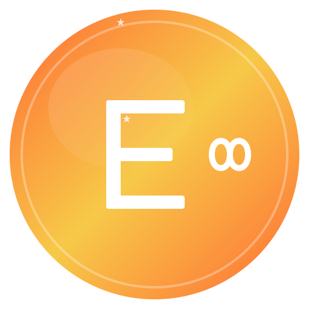

<p align="center">
  
</p>

<h1 align="center">$EVERYTHING</h1>

<p align="center">
  <strong>Why buy one thing when you can buy $EVERYTHING?</strong>
</p>

<p align="center">
  <a href="https://everything.meme">Website</a> •
  <a href="https://twitter.com/everythingcoin">Twitter</a> •
  <a href="https://t.me/everythingcoin">Telegram</a> •
  <a href="https://discord.gg/everythingcoin">Discord</a>
</p>

<p align="center">
  
  
  
  
</p>

---

## 🌎 What is $EVERYTHING?

**$EVERYTHING** is the coin that represents... well... *everything*.

Other coins pick a niche. A dog. A cat. A frog. A hat. We said — why choose? **$EVERYTHING** is the meme coin for people who want it all. The moon? That's just a pit stop. We're going to $EVERYTHING.

> "When they ask what your coin does, just say everything." — Ancient Crypto Proverb

---

## 🚀 Why $EVERYTHING?

| Feature | $EVERYTHING | Other Meme Coins |
|---------|:-----------:|:----------------:|
| Represents everything | ✅ | ❌ |
| Community vibes | 🔥🔥🔥 | 🔥 |
| Meme potential | ♾️ | Limited |
| Utility | Everything | Something or nothing |
| Name recognition | Literally everything | Just one thing |
| Rug pull | Impossible* | Maybe |

<sub>*Contract is renounced. Liquidity is burned. We literally can't rug even if we wanted to.</sub>

---

## 📊 Tokenomics

```
Total Supply:     999,999,999,999 $EVERYTHING
Tax:              0% Buy / 0% Sell
Liquidity:        🔥 Burned Forever
Contract:         ✅ Renounced
```

### Distribution

```
╔══════════════════════════════════════════╗
║  🌊 100% Fair Launch — No Presale       ║
║  🔒 Liquidity Burned                    ║
║  📜 Contract Renounced                  ║
║  🤝 Community Owned                     ║
╚══════════════════════════════════════════╝
```

---

## 🗺️ Roadmap

### Phase 1 — "Something" ✅
- [x] Launch $EVERYTHING token
- [x] Build website
- [x] Create social channels
- [x] Initial community growth
- [x] CoinGecko listing
- [x] CMC listing

### Phase 2 — "More Things" 🔄
- [x] 1,000 holders
- [x] Meme contest #1
- [ ] CEX listings
- [ ] Partnerships with other meme communities
- [ ] Merch store launch
- [ ] $EVERYTHING NFT collection

### Phase 3 — "Most Things" 🔮
- [ ] 10,000 holders
- [ ] Tier 1 CEX listing
- [ ] $EVERYTHING DAO governance
- [ ] Community grants program
- [ ] Billboard campaign
- [ ] The Everything Games (community event)

### Phase 4 — "EVERYTHING" 🌌
- [ ] 100,000 holders
- [ ] Global brand recognition
- [ ] Everything Ecosystem expansion
- [ ] ???
- [ ] Literally everything

---

## 🛠️ Tech Stack

- **Blockchain:** Solana (SPL Token)
- **Website:** HTML, CSS, Vanilla JS — *keeping it simple, keeping it fast*
- **Smart Contract:** Audited & Renounced
- **Hosting:** Decentralized via IPFS + Cloudflare

---

## 📁 Project Structure

```
everything/
├── assets/              # Logos, images, branding
│   ├── logo.svg
│   ├── banner.svg
│   └── og-image.png
├── contracts/           # Token contract (reference)
│   └── Everything.sol
├── website/             # Official website source
│   ├── index.html
│   ├── css/
│   │   └── style.css
│   └── js/
│       └── main.js
├── docs/                # Documentation
│   ├── WHITEPAPER.md
│   └── BRAND_GUIDE.md
├── .gitignore
├── CONTRIBUTING.md
├── LICENSE
├── SECURITY.md
└── README.md
```

---

## 🤝 Contributing

We love contributions from the community! See [CONTRIBUTING.md](CONTRIBUTING.md) for guidelines.

Ways to contribute:
- 🎨 Create memes
- 🐛 Report bugs on the website
- 💡 Suggest features
- 📝 Improve documentation
- 🌐 Translate content

---

## ⚠️ Disclaimer

$EVERYTHING is a meme coin created for entertainment purposes. It has no intrinsic value and no formal team behind it beyond the community. **This is not financial advice.** Always do your own research (DYOR) before investing in any cryptocurrency. Never invest more than you can afford to lose.

---

## 📜 License

This project is licensed under the MIT License — see [LICENSE](LICENSE) for details.

---

<p align="center">
  <strong>$EVERYTHING — Because why settle for something when you can have everything?</strong>
</p>

<p align="center">
  <sub>Made with ❤️ by the $EVERYTHING community</sub>
</p>
